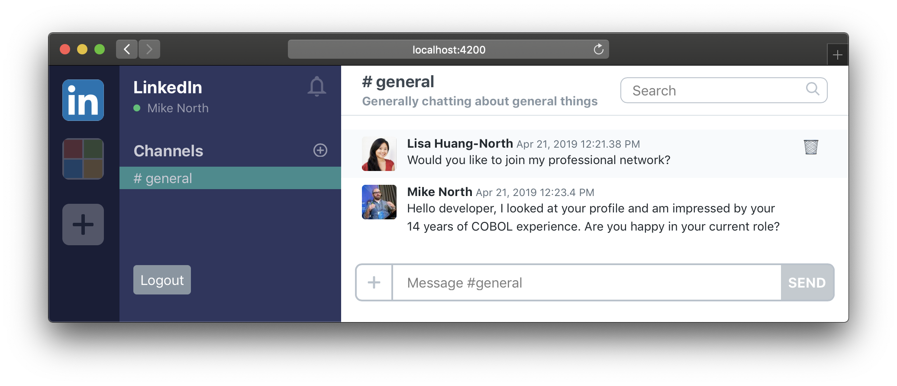

# Ember Octane Workshop: Shlack

This is the project used for the <a title="Mike North's" href="https://github.com/mike-north">Mike North's</a> <a title="Ember Octane" href="https://emberjs.com/editions/octane/">Ember Octane</a> course, where we build a chat app together step-by-step



## Prerequisites

You will need the following things properly installed on your computer.

- [Git](https://git-scm.com/)
- [Node.js](https://nodejs.org/)
- [Yarn](https://yarnpkg.com/)
- [Ember CLI](https://ember-cli.com/)
- [Brave](https://brave.com/), [Firefox](https://www.mozilla.org/en-US/firefox/) or [Chrome](https://google.com/chrome/)

# Getting Set Up

There are a few things you need to ensure you have installed, in order to be ready for this course.

### Node.js

You’ll need a relatively recent version (v10.0 or newer ideally) of Node.js installed. On OS X, a great way of doing this without disturbing your existing dev environment is to install NVM. [Installation instructions are here](https://github.com/creationix/nvm#installation).

You’ll know everything is set up properly when you can run

```
nvm --version # might look like "0.34.0"
node --version # might look like "v10.15.3"
```

### Ember-CLI

Ember-CLI is the official Ember.js build tool. It handles things like:

- Running a development web server
- Running tests
- Code generation
- Compiling static assets

We can install ember-cli globally by running

```
npm install -g ember-cli
```

Now you should be able to run

```sh
ember --version
```

and see something like

```
ember-cli: 3.10.0
node: 11.6.0
os: darwin x64
```

### Visual Studio Code

Particularly if you’ve never tried it before, you should install [Microsoft Visual Studio Code](https://code.visualstudio.com/). Some fantastic extensions that I use regularly include

- [ESlint](https://marketplace.visualstudio.com/items?itemName=dbaeumer.vscode-eslint)
- [Ember-CLI in Visual Studio Code](https://marketplace.visualstudio.com/items?itemName=felixrieseberg.vsc-ember-cli)
- [Ember Language Server](https://marketplace.visualstudio.com/items?itemName=emberjs.vscode-ember)

### Clone the Project

```sh
git clone git@github.com:FrontendMasters/ember-octane.git shlack
```

### Install dependencies

```sh
cd shlack
yarn install
```

### Start the development server

```sh
ember serve
```

- Visit your app at [http://localhost:4200](http://localhost:4200)
- Visit your tests at [http://localhost:4200/tests](http://localhost:4200/tests)
- Your app runs on localhost `:4200` by default. You can customize this via `--port <port-number>`

### Code Generators

Make use of the many built-in Ember-CLI generators to get files that follow the latest practices (with matching tests\_. To see available generators, run `ember help generate`

### Running Tests

- `ember test`
- `ember test --server`

### Linting

- `yarn lint:hbs`
- `yarn lint:js`
- `yarn lint:js --fix`

### Building

- `ember build` (development)
- `ember build --environment production` (production)

## Further Reading / Useful Links

- [ember.js](https://emberjs.com/)
- Development Browser Extensions
  - [ember inspector for chrome](https://chrome.google.com/webstore/detail/ember-inspector/bmdblncegkenkacieihfhpjfppoconhi)
  - [ember inspector for firefox](https://addons.mozilla.org/en-US/firefox/addon/ember-inspector/)

## How this starting point was created

We _could_ create a new Ember app by running the following command (you don't need to run this):

```sh
ember new <app-name>
```

This would create a project based on [the default Ember.js app blueprint](https://github.com/ember-cli/ember-cli/tree/7d9fce01d8faa4ce69cc6a8aab6f7f07b6b88425/blueprints/app). If we want to create an Ember Octane app, we can use the [official Ember Octane blueprint](https://github.com/ember-cli/ember-octane-blueprint/tree/396992a0e0582a18fe718e888a57432aaafc46fe/packages/%40ember/octane-app-blueprint) instead by running:

```sh
ember new -b @ember/octane-app-blueprint <app-name>
```

Beyond this, all I've done is...

Installed a few packages like

- [ember-cli-tailwind](https://github.com/embermap/ember-cli-tailwind)
- [ember-on-modifier](https://github.com/buschtoens/ember-on-modifier)
- [ember-cli-pretender](https://github.com/rwjblue/ember-cli-pretender)

```sh
ember install ember-cli-tailwind ember-on-modifier ember-cli-pretender
```

Added the files in the `server` folder, and the `db.json` to provide a development JSON API, and created the `notes` folder and markdown files inside it.

## Legal

&copy; 2019 LinkedIn and licensed under [BSD-2-Clause](https://opensource.org/licenses/BSD-2-Clause) license
# shlack
# shlack
# shlack
